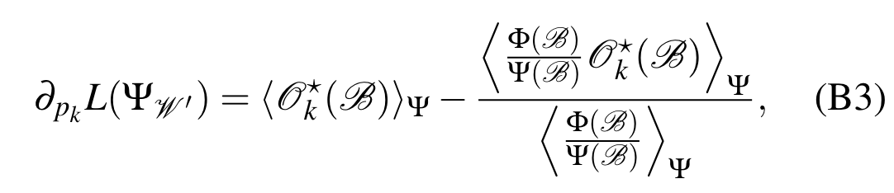
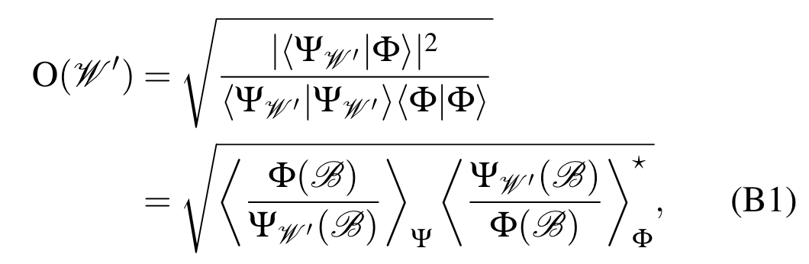
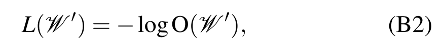

Suppose we have
$$
\begin{aligned}
O(W') &= \sqrt{\frac{|\langle\Psi_{W'}|\Phi\rangle|^2}{\langle\Psi_{W'}|\Psi_{W'}\rangle \langle\Phi|\Phi\rangle}} \\
 &=\sqrt{ \left\langle \frac{\Phi(B)}{\Psi_{W'}(B)} \right\rangle_{\Psi}  \left\langle\frac{\Psi_{W'}(B)}{\Phi(B)}\right\rangle_{\Phi}^{*}} \\ 
\end{aligned}
$$
where $\langle f(B)\rangle_A \equiv \sum_{B} f(B)\frac{|A(B)|^2}{\sum_{B}|A(B)|^2}$ is the expectation value over variational state $A$. 

Define Loss function as $L(W') = -\log O(W')$, we want to calculate the derivative.

$$
\begin{aligned}
\partial_{p_k} L(W') = -\frac{1}{2} \partial_{p_k} [\log(\left\langle \frac{\Phi(B)}{\Psi_{W'}(B)} \right\rangle_{\Psi}) + \log (\left\langle\frac{\Psi_{W'}(B)}{\Phi(B)}\right\rangle_{\Phi}^{*})]
\end{aligned}
$$

## Lemma 1

Define $O_k(B) \equiv \partial_{p_k} \log(\Psi(B))$ and $O^*_k(B) \equiv \partial_{p_k} \log(\Psi^*(B))$, and

$$
\begin{aligned}
\partial_{p_k}\langle f\rangle_{\Psi} = \langle\partial_{p_k}f\rangle_{\Psi} + \langle f(B)(O_k(B) + O_k^*(B))\rangle_{\Psi} - \langle f\rangle_{\Psi}\langle O_k(B)+O_k^*(B)\rangle_{\Psi}
\end{aligned}
$$

Proof:
$$
\langle f\rangle_{\Psi} = \frac{\sum_{B} f(B)|\Psi(B)|^2}{\sum_{B}|\Psi(B)|^2}
$$

Then the derivative can be decomposed into 3 parts, where

$$
\begin{aligned}
\partial_{p_k} \langle f\rangle_{\Psi} &= \frac{\sum_{B} [\partial_{p_k}f(B)]|\Psi(B)|^2}{\sum_{B}|\Psi(B)|^2}\\
&+\frac{\sum_{B} f(B)[\partial_{p_k}|\Psi(B)|^2]}{\sum_{B}|\Psi(B)|^2}\\
&+\frac{\sum_{B} f(B)|\Psi(B)|^2}{\partial_{p_k}\sum_{B}|\Psi(B)|^2}
\end{aligned}
$$

The first part is $\langle\partial_{p_k}f\rangle_{\Psi}$
The second part:
$$
\begin{aligned}
\frac{\sum_{B} f(B)[\partial_{p_k}|\Psi(B)|^2]}{\sum_{B}|\Psi(B)|^2} &= \frac{\sum_{B} f(B)[\Psi^*(B)\partial_{p_k}\Psi(B) + \Psi(B)\partial_{p_k}\Psi^*(B)]}{\sum_{B}|\Psi(B)|^2}\\
&= \frac{\sum_{B} f(B)|\Psi(B)|^2\partial_{p_k}[\log(\Psi(B)) + \log(\Psi^*(B))]}{\sum_{B}|\Psi(B)|^2}\\
&= \langle f(B)(O_k(B) + O_k^*(B))\rangle_{\Psi}
\end{aligned}
$$
The third part:
$$
\begin{aligned}
\frac{\sum_{B} f(B)|\Psi(B)|^2}{\partial_{p_k}\sum_{B}|\Psi(B)|^2} &= -\frac{\sum_{B} f(B)|\Psi(B)|^2}{(\sum_{B}|\Psi(B)|^2)^2}(\partial_{p_k}\sum_{B}|\Psi(B)|^2)\\
&= - \frac{\sum_{B} f(B)|\Psi(B)|^2}{\sum_{B}|\Psi(B)|^2}\frac{\partial_{p_k}\sum_{B}|\Psi(B)|^2}{\sum_{B}|\Psi(B)|^2}\\
&= - \langle f\rangle_{\Psi} \frac{\sum_{B}|\Psi(B)|^2\partial_{p_k}(\log(\Psi(B)) + \log(\Psi^*(B)))}{\sum_{B}|\Psi(B)|^2}\\
&= - \langle f\rangle_{\Psi}\langle O_k(B)+O_k^*(B)\rangle_{\Psi}
\end{aligned}
$$

## Continue calculate

$$
\begin{aligned}
\partial_{p_k} L(W') = -\frac{1}{2} \partial_{p_k} [\log(\left\langle \frac{\Phi(B)}{\Psi_{W'}(B)} \right\rangle_{\Psi}) + \log (\left\langle\frac{\Psi_{W'}(B)}{\Phi(B)}\right\rangle_{\Phi}^{*})]
\end{aligned}
$$

## Calculate the first part
Using Lemma 1 to the first part $\partial_{p_k} \log(\left\langle \frac{\Phi(B)}{\Psi_{W'}(B)} \right\rangle_{\Psi})$, then
$$
\begin{aligned}
\partial_{p_k} \log(\left\langle \frac{\Phi(B)}{\Psi_{W'}(B)} \right\rangle_{\Psi}) &= \frac{1}{\left\langle \frac{\Phi}{\Psi} \right\rangle_{\Psi}}\partial_{p_k}\left\langle \frac{\Phi(B)}{\Psi_{W'}(B)} \right\rangle_{\Psi} \\
&= \frac{1}{\left\langle \frac{\Phi}{\Psi} \right\rangle_{\Psi}} \left\langle \partial_{p_k}\frac{\Phi(B)}{\Psi_{W'}(B)} \right\rangle_{\Psi} \\
&+ \frac{1}{\left\langle \frac{\Phi}{\Psi} \right\rangle_{\Psi}}
\left\langle \frac{\Phi(B)}{\Psi_{W'}(B)}\partial_{p_k}(\log(\Psi(B))+\log(\Psi^*(B))) \right\rangle_{\Psi}\\
&- \frac{1}{\left\langle \frac{\Phi}{\Psi} \right\rangle_{\Psi}}
\left\langle \frac{\Phi(B)}{\Psi_{W'}(B)}\right\rangle_{\Psi}\left\langle\partial_{p_k}(\log(\Psi(B))+\log(\Psi^*(B))) \right\rangle_{\Psi}\\
&= -\frac{1}{\left\langle \frac{\Phi}{\Psi} \right\rangle_{\Psi}}
\left\langle \frac{\Phi(B)}{\Psi_{W'}(B)}\partial_{p_k}\log(\Psi(B)) \right\rangle_{\Psi} \\
&+ \frac{1}{\left\langle \frac{\Phi}{\Psi} \right\rangle_{\Psi}}
\left\langle \frac{\Phi(B)}{\Psi_{W'}(B)}\partial_{p_k}(\log(\Psi(B))+\log(\Psi^*(B))) \right\rangle_{\Psi}\\
&- \left\langle\partial_{p_k}(\log(\Psi(B))+\log(\Psi^*(B))) \right\rangle_{\Psi}\\
&= \frac{\left\langle \frac{\Phi(B)}{\Psi_{W'}(B)}\partial_{p_k}\log(\Psi^*(B)) \right\rangle_{\Psi}}{\left\langle \frac{\Phi}{\Psi} \right\rangle_{\Psi}}- \left\langle\partial_{p_k}(\log(\Psi(B))+\log(\Psi^*(B))) \right\rangle_{\Psi}
\end{aligned}
$$
Write it in the observable form, we get
$$
\begin{aligned}
\partial_{p_k} \log(\left\langle \frac{\Phi(B)}{\Psi_{W'}(B)} \right\rangle_{\Psi}) &= \frac{\left\langle \frac{\Phi(B)}{\Psi_{W'}(B)}O^*_k(B) \right\rangle_{\Psi}}{\left\langle \frac{\Phi}{\Psi} \right\rangle_{\Psi}}- \left\langle O_{k}(B)+O_k^*(B) \right\rangle_{\Psi}
\end{aligned}
$$

## Calculate the second part
The second part $\partial_{p_k}\log (\left\langle\frac{\Psi_{W'}(B)}{\Phi(B)}\right\rangle_{\Phi}^{*})$ can be easily calculated by

$$
\begin{aligned}
\partial_{p_k}\log (\left\langle\frac{\Psi_{W'}(B)}{\Phi(B)}\right\rangle_{\Phi}^{*}) = \frac{\left\langle\frac{\partial_{p_k}\Psi_{W'}(B)}{\Phi(B)}\right\rangle_{\Phi}^{*}}{\left\langle\frac{\Psi_{W'}(B)}{\Phi(B)}\right\rangle_{\Phi}^{*}}
\end{aligned}
$$

## Combining together
Combine the first and second parts together, we get
$$
\partial_{p_k}L(W') =\frac{1}{2}\left\langle O_{k}(B)+O_k^*(B) \right\rangle_{\Psi} - \frac{1}{2}\frac{\left\langle \frac{\Phi(B)}{\Psi(B)}O^*_k(B) \right\rangle_{\Psi}}{\left\langle \frac{\Phi}{\Psi} \right\rangle_{\Psi}} - \frac{1}{2}\frac{\left\langle\frac{\partial_{p_k}\Psi_{W'}(B)}{\Phi(B)}\right\rangle_{\Phi}^{*}}{\left\langle\frac{\Psi_{W'}(B)}{\Phi(B)}\right\rangle_{\Phi}^{*}}
$$

Which is not consistent with the result in the original paper, that is

## Possible solution

Maybe we should turn into loss function as
$$
L(W') = \frac{\langle\Psi_{W'}|\Phi\rangle}{\langle\Psi_{W'}|\Psi_{W'}\rangle}\sqrt{\langle\Psi_{W'}|\Psi_{W'}\rangle}
$$

and this time the derivative should give us expectation only depends on distribution $\Psi_{W'}$

## Appendix: Result in original paper

Paper: arxiv 1808.05232v1